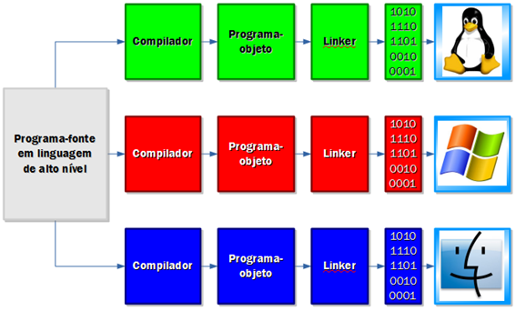

# Olá, eu sou Luis Henrique.
#### Este repositório possui a finalidade de guardar meus arquivos de estudo sobre a linguagem de programação Java.

Como material de estudo estou utilizando a playlist do YouTube "Maratona Java Virado no Jiraya", do canal DevDojo.

### Esta imagem demosntra como funciona o processo de compilção da linguagem Java.

